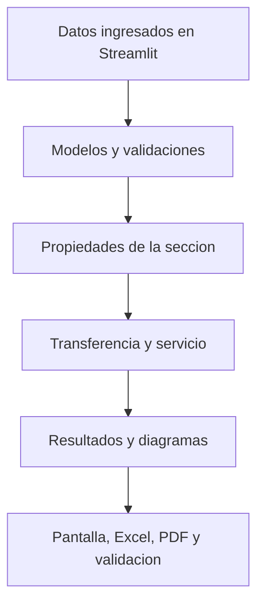

# PRE-POST — ICIV 1042

Herramienta academica para el proyecto integrador de **Hormigon Pre y
Postensado 2026**.

PRE-POST permite ingresar los datos de una viga pretensada, calcular las etapas
elasticas de transferencia y servicio, visualizar los resultados y descargar
un informe tabulado en Excel o PDF.

La version actual es **v0.5.0**.

> [!WARNING]
> PRE-POST es una herramienta academica en desarrollo. No es software
> certificado ni debe utilizarse para disenar o construir obras reales. La
> norma, las hipotesis, los datos y los resultados deben ser revisados por el
> equipo, el profesor y un profesional competente.

## Funciones disponibles

- Seccion rectangular maciza y constante.
- Area, centroide, inercia y modulos resistentes.
- Peso propio de la viga.
- Reaccion, corte y momento para una carga uniforme.
- Fuerza y tension iniciales de pretensado.
- Transferencia con fuerza inicial y peso propio.
- Fuerza efectiva a partir de una perdida global declarada.
- Servicio con peso propio, carga muerta adicional y carga viva.
- Tensiones elasticas en las fibras superior e inferior.
- Selector de unidades `SI | USCS` para entradas, resultados y reportes.
- Diagramas comparativos de corte y momento a lo largo de la viga.
- Grafico de distribucion de tensiones en la altura de la seccion.
- Exportacion tabulada a Excel y PDF.
- Casos reproducibles, pruebas automaticas y autovalidacion JSON.
- Ejecucion local o mediante Streamlit Community Cloud.

## Flujo del programa



La interfaz no repite formulas de ingenieria. Recibe los datos, convierte las
unidades visibles a SI, llama a las funciones del nucleo y presenta sus
resultados en el sistema elegido. Las series de los graficos tambien se
calculan en `src/analysis/`, por lo que pueden probarse sin abrir Streamlit.

## Sistemas de unidades

La opcion **Sistema de unidades** aparece en la parte superior de Streamlit:

| Sistema | Geometria | Fuerza y carga | Tension | Momento |
|---|---|---|---|---|
| SI | m, mm2 | kN, kN/m | MPa | kN m |
| USCS | ft, in, in2 | kip, kip/ft | psi | kip ft |

La seleccion se aplica a los campos de entrada, indicadores, ejes de los
graficos y archivos Excel/PDF. El nucleo conserva siempre `m`, `N` y `Pa`; las
conversiones se realizan solamente al entrar o salir de la aplicacion. Esto
permite cambiar de sistema sin duplicar las formulas estructurales.

## Etapas calculadas

### Transferencia

La transferencia utiliza la fuerza inicial `Pi` y el peso propio de la viga.
Para la seccion rectangular actual:

```text
A = b h
I = b h^3 / 12
wpp = gamma_c A
Mpp,max = wpp L^2 / 8
```

El programa entrega area, inercia, peso propio, momento en el centro y tensiones
en las fibras extremas.

### Servicio

La fuerza efectiva se obtiene desde una perdida global ingresada por el usuario:

```text
Pe = (1 - perdida) Pi
```

En servicio se superponen:

- peso propio;
- carga muerta adicional;
- carga viva no mayorada;
- fuerza efectiva `Pe`;
- momento de servicio;
- tensiones superior e inferior.

La perdida global es un dato. Esta version no calcula por separado acortamiento
elastico, friccion, asiento, retraccion, fluencia o relajacion.

## Graficos de resultados

Despues de presionar **Calcular etapas**, la aplicacion muestra tres pestanas:

| Grafico | Eje horizontal | Resultado comparado |
|---|---|---|
| Corte `V(x)` | Posicion a lo largo de la viga | kN o kip |
| Momento `M(x)` | Posicion a lo largo de la viga | kN m o kip ft |
| Tensiones | Altura desde el centroide | MPa o psi |

Los diagramas de la viga utilizan 101 posiciones entre ambos apoyos:

```text
V(x) = wL/2 - wx
M(x) = wLx/2 - wx^2/2
```

El perfil de tensiones interpola linealmente los resultados calculados en las
fibras inferior y superior, de acuerdo con la hipotesis elastica de secciones
planas estudiada en la Clase 3.

Convenciones:

- compresion negativa;
- traccion positiva;
- coordenada vertical positiva hacia arriba;
- momento sagante positivo;
- tendon bajo el centroide con excentricidad negativa.

## Relacion con la indicacion del profesor

El profesor solicito seleccionar secciones habituales y calcular sus
propiedades brutas, netas y transformadas, ademas de peso propio, momento y
tensiones en distintas fibras.

| Requisito | Estado actual | Proximo trabajo |
|---|---|---|
| Seleccion de secciones habituales | Parcial | Elegir proveedor y secciones de catalogo |
| Area bruta | Hecho para rectangulo | Generalizar a secciones compuestas |
| Inercia bruta | Hecho para rectangulo | Agregar ejes paralelos y geometria asimetrica |
| Seccion neta de hormigon | Pendiente | Restar vacios, ductos y rebajes |
| Seccion transformada con acero | Pendiente | Incorporar modulos, areas y coordenadas del acero |
| Peso propio | Hecho para rectangulo macizo | Usar el area real de hormigon |
| Momento por peso propio | Hecho para viga simplemente apoyada | Mantener trazabilidad por etapa |
| Tensiones en fibras extremas | Hecho para rectangulo | Generalizar a fibras arbitrarias y secciones asimetricas |
| Graficos | Hecho para el alcance actual | Adaptar a las nuevas familias de secciones |
| Excel y PDF | Hecho para el alcance actual | Incorporar tablas de seccion neta y transformada |

### Ampliacion prevista del modulo de secciones

La siguiente etapa estructural debe:

1. registrar proveedor, producto, revision y unidades del catalogo;
2. representar la geometria mediante componentes simples;
3. calcular area, centroide e inercia brutos;
4. descontar vacios para obtener la seccion neta de hormigon;
5. incorporar el acero mediante la razon modular `n = Es/Ec`;
6. almacenar distancias diferentes a las fibras superior e inferior;
7. integrar las nuevas propiedades con tensiones, graficos y reportes;
8. comparar cada resultado con un calculo manual independiente.

Una seccion I o T asimetrica no puede usar automaticamente `h/2` para ambas
fibras. Antes de admitirla, el nucleo debe trabajar con `c_superior` y
`c_inferior` independientes.

## Dónde se realiza cada tarea

| Tarea | Archivo o carpeta |
|---|---|
| Entradas tipadas y validaciones | `src/models/inputs.py` |
| Contratos de resultados | `src/models/results.py` |
| Propiedades rectangulares y peso propio | `src/sections/rectangular.py` |
| Reaccion, corte y momento | `src/analysis/loads.py` |
| Series para los graficos | `src/analysis/diagrams.py` |
| Tensiones elasticas | `src/analysis/stresses.py` |
| Transferencia | `src/analysis/case.py` |
| Servicio | `src/analysis/service.py` |
| Fuerza efectiva | `src/prestress/losses.py` |
| Interfaz y graficos | `src/app/app.py` |
| Conversion SI/USCS | `src/units.py` |
| Excel y PDF | `src/reporting/exports.py` |
| Autovalidacion | `src/validation.py` |
| Pruebas | `tests/` |
| Casos reproducibles | `examples/` |
| Alcance y trazabilidad | `docs/` |

## Casos de referencia

| Caso | Proposito |
|---|---|
| Caso A | Control analitico propio de geometria, peso, momento y transferencia |
| Caso S1 | Comprobacion de fuerza efectiva y tensiones de servicio con la Clase 3 USS 2026 |

La version v0.5.0 comprueba automaticamente el nucleo, los graficos, las
conversiones reversibles SI/USCS, la interfaz y los reportes. La autovalidacion
contiene once comparaciones numericas entre valores esperados y resultados
obtenidos.

## Instalacion local

Requiere Python 3.11 o superior.

```bash
python -m venv .venv
```

Activacion en Windows PowerShell:

```powershell
.venv\Scripts\Activate.ps1
```

Activacion en macOS o Linux:

```bash
source .venv/bin/activate
```

Instalacion:

```bash
python -m pip install --upgrade pip
python -m pip install -e ".[dev,app]"
```

## Verificacion

```bash
python -m pytest
python -m src.validation --all --output outputs/validation_summary.json
```

La autovalidacion debe finalizar con:

```text
Autovalidacion: PASS
```

## Ejecucion de la interfaz

```bash
streamlit run src/app/app.py
```

En Streamlit Community Cloud:

```text
Repository: figuezZ/PRE-POST
Branch: main
Main file path: src/app/app.py
```

Si la aplicacion alojada conserva una version anterior, utilizar **Manage app →
Reboot app**.

## Uso

1. Elegir **SI** o **USCS** en la parte superior.
2. Completar la identificacion y los datos de la viga en esas unidades.
3. Presionar **Calcular etapas**.
4. Revisar las pestanas **Transferencia** y **Servicio**.
5. Abrir **Corte**, **Momento** y **Tensiones en la seccion**.
6. Descargar el Excel o PDF tabulado en el mismo sistema elegido.

Excel y PDF corresponden a la misma ejecucion del nucleo. En v0.5.0 los
graficos se muestran en Streamlit, pero todavia no se incrustan dentro de los
archivos descargables.

## Limitaciones actuales

- seccion rectangular maciza y constante;
- viga simplemente apoyada;
- cargas uniformemente distribuidas;
- perdida global ingresada por el usuario;
- ACI 318-19 como referencia provisional;
- sin verificaciones normativas ejecutables;
- sin secciones netas o transformadas;
- sin perdidas calculadas por mecanismo;
- sin fisuracion, flecha, resistencia, corte o anclaje.

Las limitaciones representan una secuencia de desarrollo y deben resolverse
antes de presentar PRE-POST como una herramienta de diseno completa.
