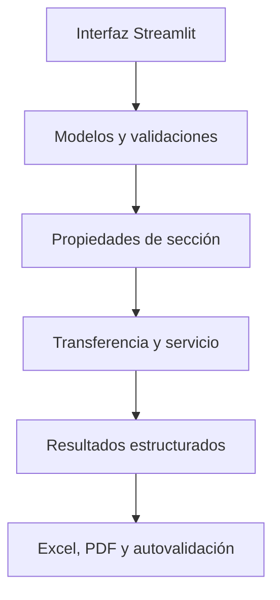

# PRE-POST — ICIV 1042

Herramienta académica para el proyecto integrador de **Hormigón Pre y Postensado 2026**.

PRE-POST permite ingresar los datos de una viga, ejecutar cálculos elásticos de
transferencia y servicio, revisar resultados en una interfaz Streamlit y descargar
un informe tabulado en Excel o PDF.

La versión actual es **v0.3.0**. El siguiente objetivo del proyecto es ampliar el
motor geométrico para trabajar con secciones habituales de proveedores y calcular
sus propiedades **brutas, netas y transformadas**, de acuerdo con la nueva
indicación del profesor.

> [!WARNING]
> PRE-POST es una herramienta académica en desarrollo. No es software certificado
> ni debe utilizarse para diseñar o construir obras reales. La norma, las hipótesis,
> los datos y los resultados deben ser revisados por el equipo, el profesor y un
> profesional competente.

## Nueva indicación del profesor

El módulo de secciones debe permitir, como mínimo:

1. Seleccionar las secciones de viga que utilizará el proyecto, idealmente a partir
   de catálogos de proveedores locales.
2. Calcular el área bruta de la sección.
3. Calcular el momento de inercia de la sección bruta.
4. Calcular las propiedades de la sección neta, considerando únicamente el
   hormigón.
5. Calcular las propiedades de la sección transformada, incorporando el acero.
6. Calcular el peso propio de la viga.
7. Calcular el momento producido por el peso propio.
8. Calcular tensiones en distintas fibras con el procedimiento estudiado en clases.
9. Presentar entradas y resultados de manera clara e intuitiva.
10. Dejar una estructura que permita incorporar nuevos módulos sin duplicar las
    fórmulas.

Este README documenta cómo se relaciona esa pauta con lo ya construido y cómo se
propone implementarla. **La ampliación de secciones todavía no está programada en
v0.3.0.**

## Estado frente a la nueva pauta

| Requisito | Estado en v0.3.0 | Evidencia actual | Trabajo pendiente |
|---|---|---|---|
| Selección de secciones habituales | **PARCIAL** | Existe una sección rectangular parametrizable | Elegir proveedor, registrar fuente y cargar secciones I, T u otras seleccionadas |
| Área bruta | **HECHO para rectángulo** | (A_g=bh) en `src/sections/rectangular.py` | Generalizar a secciones compuestas |
| Inercia bruta | **HECHO para rectángulo** | (I_g=bh^3/12) | Incorporar ejes paralelos y geometrías asimétricas |
| Sección neta de hormigón | **PENDIENTE** | No existe representación de vacíos, ductos o rebajes | Restar componentes no pertenecientes al hormigón |
| Sección transformada con acero | **PENDIENTE** | Se conoce el área total de acero de pretensado, pero no su módulo ni todas sus coordenadas | Agregar (E_s), (E_p), capas de acero y razón modular |
| Peso propio | **HECHO para rectángulo macizo** | (w_{pp}=gamma_c A_g) | Usar el área real de hormigón de la sección seleccionada |
| Momento por peso propio | **HECHO para viga simplemente apoyada** | (M_{pp,max}=w_{pp}L^2/8) | Permitir revisión en cualquier posición (x) y nuevas condiciones solo si la pauta lo exige |
| Tensiones en fibras | **PARCIAL** | Calcula fibra superior e inferior para la sección rectangular | Permitir cualquier fibra y usar centroide/inercia bruta, neta o transformada según la etapa |
| Presentación de resultados | **HECHO en el alcance actual** | Interfaz Streamlit y tablas de resultados | Agregar comparador bruta–neta–transformada y esquema de sección |
| Exportación | **HECHO en el alcance actual** | Descarga Excel y PDF | Incorporar tablas y trazabilidad de las nuevas propiedades |
| Validación | **HECHO en el alcance actual** | Casos versionados, pytest y autovalidación | Añadir ejemplos manuales para sección neta y transformada |

## Funciones disponibles actualmente

### Transferencia

Para una viga rectangular simplemente apoyada, el programa calcula:

- área, centroide, inercia y módulos resistentes;
- peso propio de la viga;
- reacción, corte máximo y momento máximo por carga uniforme;
- tensión inicial del acero (f_{pi}=P_i/A_p);
- tensiones elásticas superior e inferior con la fuerza inicial (P_i);
- resultado estructurado reutilizable por la interfaz, las pruebas y los reportes.

### Servicio

La aplicación también distingue la etapa de servicio:

[
P_e=(1-
ho_{mathrm{pérdida}})P_i
]

donde la pérdida global (
ho_{mathrm{pérdida}}) es ingresada por el usuario.
La versión actual **no calcula por separado** acortamiento elástico, fricción,
asiento, retracción, fluencia o relajación.

En servicio se superponen:

- peso propio;
- carga muerta adicional;
- carga viva no mayorada;
- fuerza efectiva (P_e);
- momento de servicio;
- tensiones superior e inferior.

### Exportación y uso en la nube

Después de calcular, Streamlit permite descargar:

- un archivo Excel con valores numéricos editables;
- un PDF tabulado de dos páginas;
- unidades, datos de entrada, propiedades, transferencia, servicio, convenciones
  y advertencias.

La aplicación está preparada para ejecutarse en Streamlit Community Cloud. El
archivo `requirements.txt` fuerza la instalación con `pip`, y el punto de entrada
agrega la raíz del repositorio para que el paquete `src` pueda importarse
correctamente en la nube.

## Casos de referencia y pruebas

| Caso | Propósito | Alcance |
|---|---|---|
| Caso A — control analítico | Verificar propiedades rectangulares, peso propio, momento y tensiones de transferencia | Validación manual y automática |
| Caso B — Ejemplo 6 | Comparar reacción, corte y momento en el límite de una región D | Equilibrio global; bielas y tirantes pendiente |
| Caso S1 — Clase 3 | Verificar fuerza efectiva y tensiones elásticas de servicio | Basado en el material docente 2026 |

La última verificación publicada de v0.3.0 aprobó **41 pruebas automáticas** y
**14 comparaciones numéricas**. El número de pruebas puede aumentar a medida que
se incorporen nuevos módulos.

## Arquitectura actual



La interfaz no contiene fórmulas estructurales. Su responsabilidad es recibir
datos, construir objetos validados, llamar al núcleo y mostrar los resultados.
Esto evita que una misma ecuación tenga versiones diferentes en pantalla, Excel,
PDF y pruebas.

## Dónde se realiza cada tarea

| Tarea | Archivo o carpeta | Responsabilidad |
|---|---|---|
| Validar entradas | `src/models/inputs.py` | Unidades SI, valores positivos, geometría, cargas y pretensado |
| Guardar resultados | `src/models/results.py` | Contratos de salida para sección, transferencia y servicio |
| Propiedades rectangulares | `src/sections/rectangular.py` | Área, centroide, inercia, módulos y peso propio |
| Cargas uniformes | `src/analysis/loads.py` | Reacción, corte y momento máximo o en una posición (x) |
| Tensiones elásticas | `src/analysis/stresses.py` | Tensión axial y flexión por pretensado y carga externa |
| Orquestar transferencia | `src/analysis/case.py` | Une sección, peso propio, solicitaciones y tensiones |
| Orquestar servicio | `src/analysis/service.py` | Aplica (P_e), cargas de servicio y tensiones |
| Fuerza efectiva | `src/prestress/losses.py` | Aplica una pérdida global declarada |
| Interfaz | `src/app/app.py` | Formularios, pestañas, métricas y descargas |
| Excel y PDF | `src/reporting/exports.py` | Presenta resultados sin repetir fórmulas |
| Autovalidación | `src/validation.py` | Reproduce casos versionados y compara tolerancias |
| Pruebas | `tests/` | Regresión, unidades, casos físicos, Excel y PDF |
| Ejemplos | `examples/` | Datos y resultados esperados reproducibles |
| Alcance | `docs/alcance.md` | Hipótesis, exclusiones y convenciones |
| Trazabilidad | `docs/matriz_requisitos.md` | Relación requisito–fórmula–módulo–prueba |

## Convenciones vigentes

- Unidades internas: metro, newton y pascal.
- Compresión negativa y tracción positiva.
- Coordenada vertical positiva hacia arriba.
- Excentricidad positiva hacia arriba.
- Un tendón bajo el centroide tiene (e<0).
- Momento externo sagante positivo.
- ACI 318-19 continúa como referencia **provisional**, sin verificaciones
  normativas ejecutables.

La guía de Clase 3 mide la excentricidad positiva hacia abajo. Por eso:

[
e_{mathrm{PRE	ext{-}POST}}=-e_{mathrm{guía}}
]

## Fórmulas que ya utiliza el núcleo

Para la sección rectangular actual:

[
A_g=bh
]

[
ar y=rac{h}{2}
]

[
I_g=rac{bh^3}{12}
]

[
w_{pp}=gamma_c A_g
]

Para una viga simplemente apoyada sometida a carga uniforme:

[
R_A=R_B=rac{wL}{2}
]

[
V(x)=R_A-wx
]

[
M(x)=R_Ax-rac{wx^2}{2}
]

[
M_{max}=rac{wL^2}{8}
]

Las tensiones elásticas actuales siguen:

[
sigma(y)=-rac{P}{A}
-rac{(Pe+M)y}{I}
]

donde (Pe) dentro del producto representa (Pcdot e), no la fuerza efectiva
(P_e). En el código se evita esta ambigüedad usando nombres separados para la
fuerza, la excentricidad y el momento de pretensado.

## Diseño propuesto para el módulo de secciones

### 1. Catálogo trazable

Cada sección seleccionada deberá guardar:

- identificador y nombre comercial;
- proveedor;
- enlace o documento de origen;
- fecha o revisión del catálogo;
- unidades originales;
- dimensiones del contorno;
- vacíos, ductos o rebajes;
- área y coordenada de cada capa de acero;
- observaciones y supuestos de modelación.

Los datos del catálogo serán entradas versionadas. Las propiedades se calcularán
en el programa; no se copiarán resultados sin comprobarlos.

### 2. Sección bruta

La geometría podrá representarse como suma de componentes simples. Para cada
componente (i):

[
A_g=sum A_i
]

[
ar y_g=rac{sum A_i y_i}{A_g}
]

[
I_g=sumleft(I_i+A_i(y_i-ar y_g)^2
ight)
]

Esto permite formar secciones rectangulares, T o I sin escribir una fórmula
distinta para cada producto.

### 3. Sección neta de hormigón

Se utilizarán áreas con signo:

- (s_i=+1) para hormigón;
- (s_i=-1) para vacíos, ductos y rebajes.

[
A_n=sum s_iA_i
]

[
ar y_n=rac{sum s_iA_iy_i}{A_n}
]

[
I_n=sum s_ileft(I_i+A_i(y_i-ar y_n)^2
ight)
]

La sección neta contendrá **solo el hormigón real**. Así se evita contar dos veces
el volumen ocupado por acero o ductos.

### 4. Sección transformada

El acero se transformará al material de referencia, inicialmente hormigón:

[
n_j=rac{E_j}{E_c}
]

Si (A_n) ya excluye físicamente el acero:

[
A_{tr}=A_n+sum n_jA_{sj}
]

[
ar y_{tr}=
rac{A_nar y_n+sum n_jA_{sj}y_{sj}}{A_{tr}}
]

[
I_{tr}=I_n+A_n(ar y_n-ar y_{tr})^2+
sum n_jleft[I_{sj}+A_{sj}(y_{sj}-ar y_{tr})^2
ight]
]

La razón modular deberá ser dependiente de la etapa:

[
n_{p,i}=rac{E_p}{E_{ci}}
qquad
n_{p,e}=rac{E_p}{E_c}
]

De esta forma, transferencia y servicio podrán usar propiedades transformadas
coherentes con el módulo del hormigón de cada etapa.

### 5. Peso propio y momento

El peso propio utilizará el área real de hormigón, no el área transformada:

[
w_{pp}=gamma_cA_n
]

Si se requiere mayor precisión, el peso lineal del acero podrá sumarse como una
contribución separada. Nunca se usará (A_{tr}) para calcular peso físico.

### 6. Tensiones en cualquier fibra

El módulo general deberá aceptar una coordenada (y_f):

[
sigma_c(y_f)=
-rac{P}{A_{mathrm{ref}}}
-rac{(Pe+M)(y_f-ar y_{mathrm{ref}})}{I_{mathrm{ref}}}
]

El usuario podrá revisar:

- fibra superior;
- fibra inferior;
- centroide;
- nivel de cada capa de acero;
- cualquier fibra de control agregada manualmente.

Para acero transformado, la tensión se recuperará mediante compatibilidad de
deformaciones y razón modular. El informe indicará siempre si las propiedades
utilizadas son brutas, netas o transformadas.

## Cambio técnico obligatorio antes de admitir secciones I o T

El cálculo actual de tensiones usa (h/2) para las dos fibras extremas, lo que es
correcto para el rectángulo simétrico actual. Una sección I o T asimétrica puede
tener:

[
c_{mathrm{sup}}
eq c_{mathrm{inf}}
]

Por ello, el modelo de resultados deberá almacenar explícitamente:

- coordenada del centroide;
- distancia a la fibra superior;
- distancia a la fibra inferior;
- módulo resistente superior;
- módulo resistente inferior.

Agregar una sección de catálogo sin efectuar este cambio produciría tensiones
incorrectas aunque el área y la inercia fueran correctas.

## Archivos previstos para la ampliación

La implementación podrá organizarse así:

```text
src/
├── sections/
│   ├── rectangular.py       # compatibilidad con el Caso A
│   ├── components.py        # rectángulos, vacíos y capas
│   ├── gross.py             # propiedades brutas
│   ├── net.py               # hormigón neto
│   ├── transformed.py       # acero homogeneizado
│   └── catalog.py           # lectura y trazabilidad de secciones
├── analysis/
│   └── stresses.py          # fibras arbitrarias y secciones asimétricas
└── app/
    └── app.py               # selector y comparación de propiedades

examples/
└── section_catalog.json

tests/
├── test_gross_section.py
├── test_net_section.py
├── test_transformed_section.py
└── test_catalog_section.py
```

Los nombres son una propuesta de diseño; podrán ajustarse durante la
implementación sin cambiar las responsabilidades.

## Plan de implementación propuesto

### Etapa 1 — Selección y trazabilidad

- [ ] Elegir entre tres y cinco secciones habituales.
- [ ] Registrar proveedor, catálogo, revisión y unidades.
- [ ] Digitalizar dimensiones, vacíos y coordenadas.
- [ ] Definir un caso manual de control por cada familia geométrica.

### Etapa 2 — Motor geométrico

- [ ] Mantener el cálculo rectangular existente como prueba de regresión.
- [ ] Implementar componentes y teorema de ejes paralelos.
- [ ] Calcular propiedades brutas.
- [ ] Calcular propiedades netas de hormigón.
- [ ] Calcular propiedades transformadas con acero.
- [ ] Validar centroides, áreas e inercias físicamente posibles.

### Etapa 3 — Integración estructural

- [ ] Corregir distancias a fibras para secciones asimétricas.
- [ ] Calcular peso propio con área real de hormigón.
- [ ] Calcular (M_{pp}(x)) y (M_{pp,max}).
- [ ] Calcular tensiones en fibras de control.
- [ ] Permitir elegir propiedades brutas, netas o transformadas de forma
      explícita y trazable.

### Etapa 4 — Interfaz y reportes

- [ ] Agregar selector de proveedor y sección.
- [ ] Mostrar esquema acotado de la geometría.
- [ ] Comparar propiedades bruta, neta y transformada.
- [ ] Incorporar las nuevas tablas al Excel y PDF.
- [ ] Informar fuente, versión del catálogo, etapa y razón modular.

### Etapa 5 — Pruebas y aceptación

- [ ] Comparar cada sección con un cálculo manual independiente.
- [ ] Verificar que (A_g>A_n>0) cuando existan vacíos.
- [ ] Verificar que el centroide quede dentro de la altura de la sección.
- [ ] Verificar inercia positiva y unidades SI.
- [ ] Confirmar que el peso propio no use área transformada.
- [ ] Probar fibras superior, inferior e intermedias.
- [ ] Conservar aprobados los Casos A, B y S1.
- [ ] Verificar apertura y contenido de Excel y PDF.
- [ ] Ejecutar `pytest` y la autovalidación antes de publicar.

## Decisiones necesarias antes de programar

1. Qué proveedor o catálogo utilizará el grupo.
2. Qué secciones exactas se incorporarán.
3. Si el sistema será pretensado, postensado o ambos.
4. Qué elementos se restarán en la sección neta: ductos, huecos, rebajes,
   vainas, anclajes u otros.
5. Qué acero se incorporará a la sección transformada: pretensado, armadura
   pasiva o ambos.
6. Valores de (E_{ci}), (E_c), (E_p) y (E_s), o reglas autorizadas para
   obtenerlos.
7. Edición normativa oficial. ACI 318-19 sigue siendo provisional en el proyecto.

## Instalación local

Requiere Python 3.11 o superior.

```bash
python -m venv .venv
```

Activación en Windows PowerShell:

```powershell
.venv\Scripts\Activate.ps1
```

Activación en macOS o Linux:

```bash
source .venv/bin/activate
```

Instalación:

```bash
python -m pip install --upgrade pip
python -m pip install -e ".[dev,app]"
```

## Ejecución de pruebas

```bash
python -m pytest
python -m src.validation --all --output outputs/validation_summary.json
```

La autovalidación debe finalizar con:

```text
Autovalidacion: PASS
```

## Ejecución de la interfaz

```bash
streamlit run src/app/app.py
```

En Streamlit Community Cloud:

```text
Repository: figuezZ/PRE-POST
Branch: main
Main file path: src/app/app.py
```

## Cómo probar la exportación

1. Abrir **Caso A — transferencia y servicio**.
2. Completar los datos.
3. Presionar **Calcular etapas**.
4. Revisar las pestañas **Transferencia** y **Servicio**.
5. Presionar **Descargar Excel** o **Descargar PDF**.

Los dos archivos corresponden a la misma ejecución y reciben resultados ya
calculados por el núcleo; el módulo de reportes no duplica fórmulas de ingeniería.

## Alcance y limitaciones actuales

Incluido en v0.3.0:

- sección rectangular maciza y constante;
- viga simplemente apoyada;
- carga uniformemente distribuida;
- transferencia con fuerza inicial y peso propio;
- servicio con fuerza efectiva y cargas no mayoradas;
- pérdida global ingresada por el usuario;
- Excel, PDF, casos reproducibles y pruebas automáticas.

Pendiente:

- catálogo y familias I, T u otras;
- sección neta y transformada;
- pérdidas por mecanismo;
- límites normativos;
- fisuración y flecha;
- resistencia a flexión y corte;
- anclaje y detallamiento;
- modelo completo de bielas y tirantes del Caso B.

Las exclusiones representan una secuencia de desarrollo, no una renuncia a los
requisitos del producto final.

## Próximo hito

El próximo hito propuesto es **PRE-POST v0.4.0 — Propiedades de secciones**:

1. seleccionar y documentar el catálogo;
2. implementar la geometría bruta;
3. implementar la sección neta de hormigón;
4. implementar la sección transformada con acero;
5. integrar peso propio, momento y tensiones por fibra;
6. ampliar Streamlit, Excel, PDF y pruebas.

No se comenzará la implementación numérica hasta fijar las secciones y los datos
de catálogo que utilizará el grupo.
